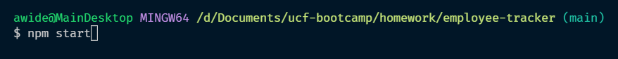
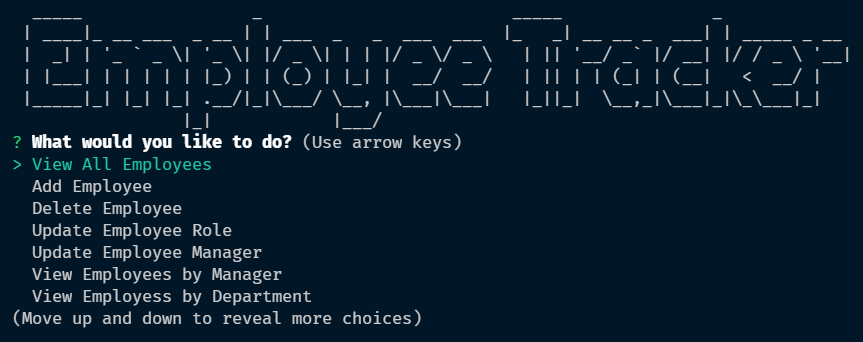
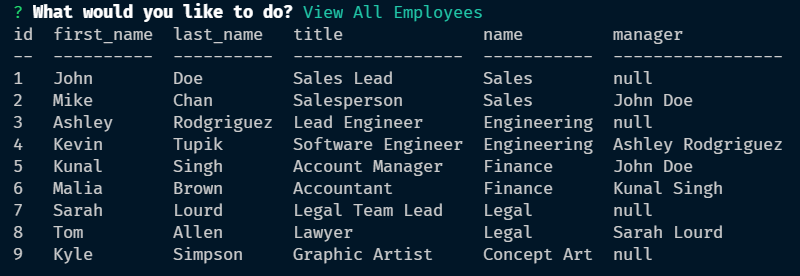
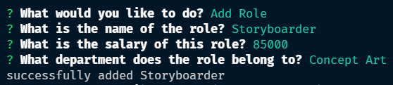
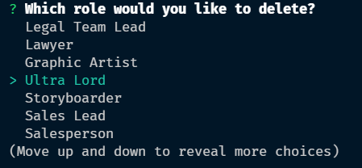
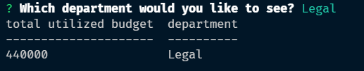
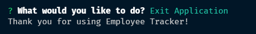

# 📝 Homework #12: Employee Tracker

## 🎥 Video Walkthrough
[Video Walkthrough](https://drive.google.com/file/d/1Lh-kdHDTPclcniIsOZhPGkogxoTgTOkP/view?usp=sharing)

## 🔨 Task
To create a Content Management System that allows a user to track and edit information on an employee, their roles, departments and managers. This project utilizes Node.js, Inquirer and MySQL.

## 📎 How to Use
Begin by running `npm start` in the Terminal. From here, a start screen will display with the title of the project, and a menu of choices available to you. 

Select one of these choices and you will either receive a table if you selected to view some information, or you will be prompted by the command line to enter information.

After each route is complete, you will be prompted again if you would like to continue using the application, but you are able to exit the program at any time.

## 🔍 Preview

https://user-images.githubusercontent.com/70721378/152450515-bf4c0348-e558-46f2-938c-bcad3c21fa21.mp4

## 📷 Screenshots
Begin the application by called `npm start` in the terminal of the root directory of the application



You will then be greeted with a welcome screen, along with a scrollable menu giving you all available options in the application



Selecting an option with **View** will return a table with the information from the database



Selecting an option with **Add** will prompt you several questions and add the item to the database



Selecting an option with **Delete** will give you a list of choices of items to delete, then remove that item from the database



There are a few bonus options that show more in-depth information



Running **Exit Application** ends the application and sends you back to the terminal screen



## User Story

```md
AS A business owner
I WANT to be able to view and manage the departments, roles, and employees in my company
SO THAT I can organize and plan my business
```

## Acceptance Criteria

```md
GIVEN a command-line application that accepts user input
WHEN I start the application
THEN I am presented with the following options: view all departments, view all roles, view all employees, add a department, add a role, add an employee, and update an employee role
WHEN I choose to view all departments
THEN I am presented with a formatted table showing department names and department ids
WHEN I choose to view all roles
THEN I am presented with the job title, role id, the department that role belongs to, and the salary for that role
WHEN I choose to view all employees
THEN I am presented with a formatted table showing employee data, including employee ids, first names, last names, job titles, departments, salaries, and managers that the employees report to
WHEN I choose to add a department
THEN I am prompted to enter the name of the department and that department is added to the database
WHEN I choose to add a role
THEN I am prompted to enter the name, salary, and department for the role and that role is added to the database
WHEN I choose to add an employee
THEN I am prompted to enter the employee’s first name, last name, role, and manager, and that employee is added to the database
WHEN I choose to update an employee role
THEN I am prompted to select an employee to update and their new role and this information is updated in the database 
```

